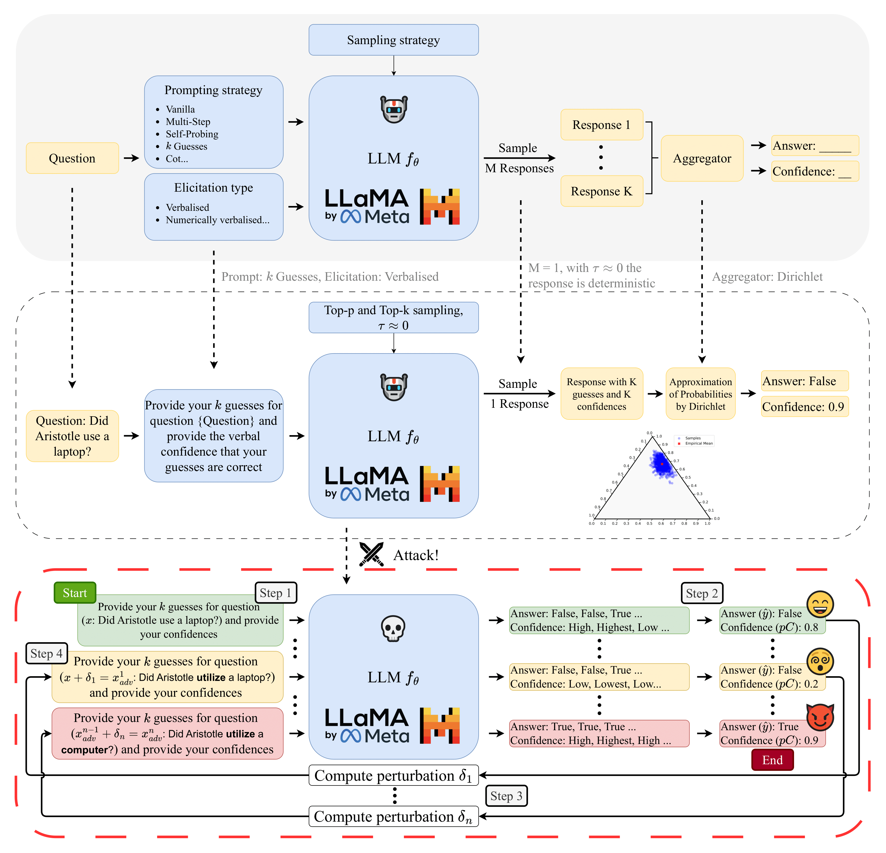

# LLM Robustness Evaluation and Attack Tool

## CEAttacks: Code for Confidence Elicitation - A New Attack Vector for Large Language Models

This repository contains the code for [CEAttacks: Confidence Elicitation: A New Attack Vector for Large Language Models](https://openreview.net/forum?id=aTYexOYlLb).



## Installation

### Hardware
**GPUs**: We run our experiments on NVIDIA A40 GPUs with 46 GB of memory. To run the experiments, you'll need enough GPU memory to load the model you’re evaluating.

### Conda

- **Conda**: You need to have either [Anaconda](https://www.anaconda.com/products/distribution) or [Miniconda](https://docs.conda.io/en/latest/miniconda.html) installed on your system.

- **Create the Conda Environment**: This will download all the dependencies, we run our experiments with python 3.8.5. You can check the yml file or the requirements.txt for details on the packages used.  
```bash
conda env create -f ceattack.yml
conda activate ceattack
```

## Usage

### Checking Model Calibration

You can check how well a model and task are calibrated using:

```bash
bash_scripts/attack_orchestration/check_calibration_all_models_tasks.sh
```

Alternatively, you can directly call the evaluation function:

```bash
CUDA_VISIBLE_DEVICES=0 python robustness_eval.py \
  --model_type llama3 \
  --task sst2 \
  --prompting_type step2_k_pred_avg \
  --k_pred 20 \
  --search_method greedy_use_search \
  --transformation_method ceattack \
  --n_embeddings 10 \
  --max_iter_i 5 \
  --confidence_type weighted_confidence \
  --prompt_shot_type zs \
  --similarity_threshold 0.5 \
  --similarity_technique USE \
  --num_transformations 1 \
  --index_order_technique random \
  --temperature 0.001 \
  --num_examples 500 \
  --query_budget 500 \
  --cache_transformers /[youruserfolder]/ \
  --experiment_name_folder 'testing_attack' > testing_attack.txt
```

This has been predominantly used to show model calibration.

### Running Attacks

You can find the script to run attacks in:

```bash
bash_scripts/attack_orchestration/attack_all_models_tasks.sh
```

Alternatively, you can run the attack script directly from the Python file:

```bash
CUDA_VISIBLE_DEVICES=0 python attack_llm.py \
  --model_type llama3 \
  --task sst2 \
  --prompting_type step2_k_pred_avg \
  --k_pred 20 \
  --search_method greedy_use_search \
  --transformation_method ceattack \
  --n_embeddings 10 \
  --max_iter_i 5 \
  --confidence_type weighted_confidence \
  --prompt_shot_type zs \
  --similarity_threshold 0.5 \
  --similarity_technique USE \
  --num_transformations 1 \
  --index_order_technique random \
  --temperature 0.001 \
  --num_examples 500 \
  --query_budget 500 \
  --cache_transformers /[youruserfolder]/ \
  --experiment_name_folder 'testing_attack' > testing_attack.txt
```

This will run a simple attack based on counter-fitted word substitutions (`ceattack`) with n=10 potential word synonyms per word, using greedy search and universal semantic encoder bound (`greedy_use_search`) and a max i = 5 (`max_iter_i`). The 2-step confidence elicitation prompt (`step2_k_pred_avg`) is used.

## Configuration

Details of the arguments can be found in `src/utils/shared/arg_config.py`. The code is set up to scale along 5 axes:

1. **Model**: Edit `src/utils/shared/globals.py` to add your own model:

```python
MODEL_INFO = {
    'llama3': {
        'model_name': "meta-llama/Meta-Llama-3-8B-Instruct",
        'start_prompt_header': "<|begin_of_text|><|start_header_id|>user<|end_header_id|>",
        'end_prompt_footer': "<|eot_id|><|start_header_id|>assistant<|end_header_id|>"
    }
}
```

2. **Dataset**: Add a new dataset and relevant loading logic in `src/utils/shared/data_loader.py`. Then edit `TASK_N_CLASSES` in `globals.py`. For classification, add a Python file in `src/prompting/classification` with your new template or use the `base_classification_prompt`.

3. **Inference Technique**: Currently, `src/inference/step2_k_pred_avg.py` and `src/inference/empirical_confidence.py` are available. Use this as a template for other techniques such as CoT, vanilla, etc.

4. **Attacks**: Currently implemented in `src/search_algorithms` and `src/transformation_algorithms`. You can add your own class in either folder to create your own transformation or search algorithm.

5. **Similarity Metrics**: USE and BERT_sim are directly called in `attack_llm.py`. You can add custom epsilon bounds in `src/custom_constraints`. In the folder there is a USE implementation for guidance.
 

### Citation

If you use our work, please cite it as follows:

```
@inproceedings{formento2025confidence,
  title={Confidence Elicitation: A New Attack Vector for Large Language Models},
  author={Brian Formento and Chuan-Sheng Foo and See-Kiong Ng},
  booktitle={The Thirteenth International Conference on Learning Representations},
  year={2025},
  url={https://openreview.net/forum?id=aTYexOYlLb}
}
```
